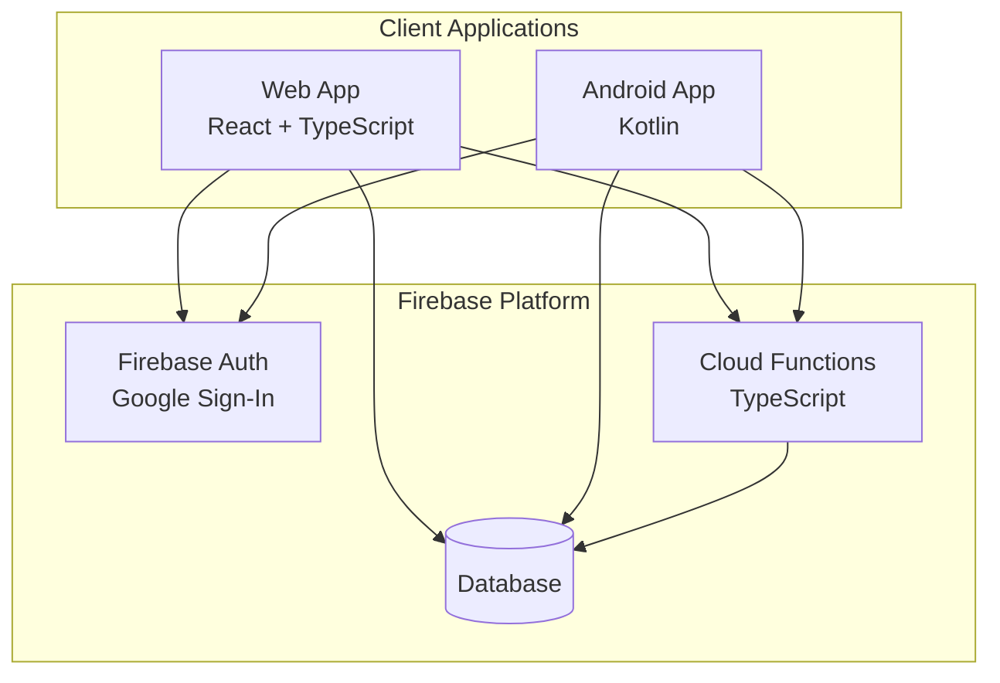
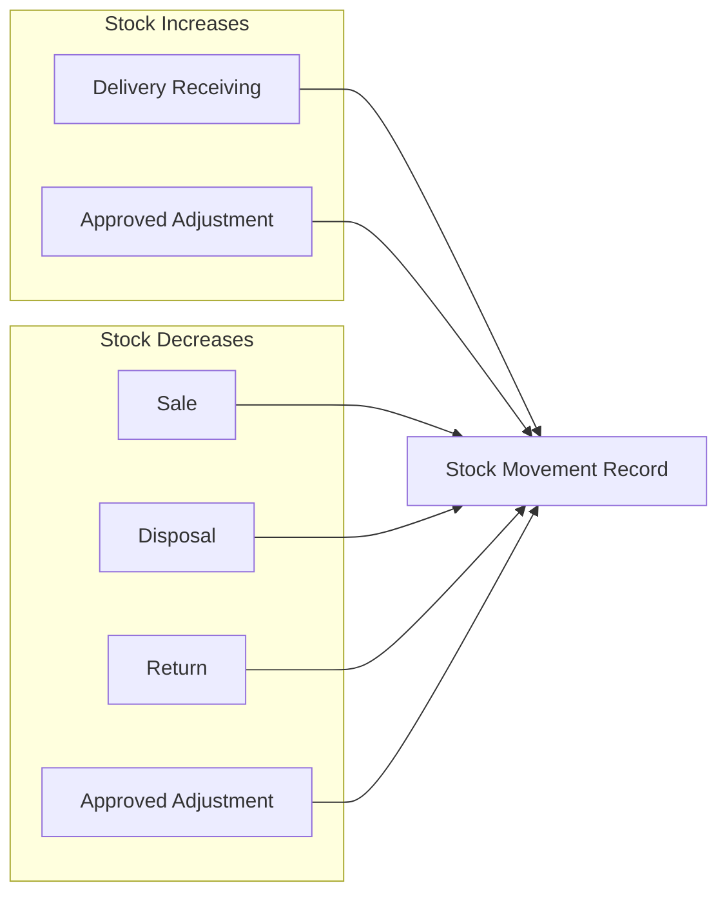

# System Overview

## What Is StockMate POS?

StockMate POS is a cloud-based inventory and point-of-sale system designed for stores with one or more branches. It connects back-office administration (web) with front-line store operations (Android).

## System Architecture



## Components

### Web App

Used by owners and administrators for:

- Product and category setup
- Pricing and promos
- Supplier and purchase order management
- Delivery monitoring
- Reports and dashboards
- User and branch management
- Business settings

### Android App

Used by cashiers and store managers for:

- Point of sale (POS)
- Barcode scanning
- Delivery receiving and verification
- Stock checking and critical stock alerts
- Stock disposal / expired tagging
- Receipt and delivery receipt printing

### Database

All business data is scoped under `stores/{storeId}/`.

### Cloud Functions

Secure backend layer. Sensitive operations (sales, stock changes, price changes, delivery receiving) **must** run through Cloud Functions — never direct client writes to protected fields.

### Firebase Auth

Google Sign-In for all users. Role and branch assignment is enforced by Cloud Functions and security rules.

---

## Inventory Philosophy

### Removed Concepts

The following are **explicitly not used** in StockMate POS:

| Removed | Reason |
|---------|--------|
| FEFO (First Expired, First Out) | Cashiers may not check expiry during selling |
| FIFO (First In, First Out) | Same practical constraint at checkout |
| Required batch number | Adds friction without reliable enforcement at POS |
| Required lot number | Same as batch |
| Automatic expiry-based selling order | System must not assume expiry is checked at sale time |

### Current Model

| Concept | Behavior |
|---------|----------|
| **Stock quantity** | Single `currentStock` per product (per branch where applicable) |
| **Expiry date** | Optional — captured at delivery receiving or on product record |
| **Lot / batch number** | Optional metadata only |
| **Expired / disposed** | Manual tagging via Stock Disposal flow |
| **Stock deduction on disposal** | Automatic when disposal is submitted |

### Stock Change Summary



Every stock change creates a `stockMovements` document. See [Business Rules](09-business-rules.md).

### Sale Deduction

Simple quantity subtraction — no batch or expiry logic:

```
newStock = currentStock - soldQty
```
