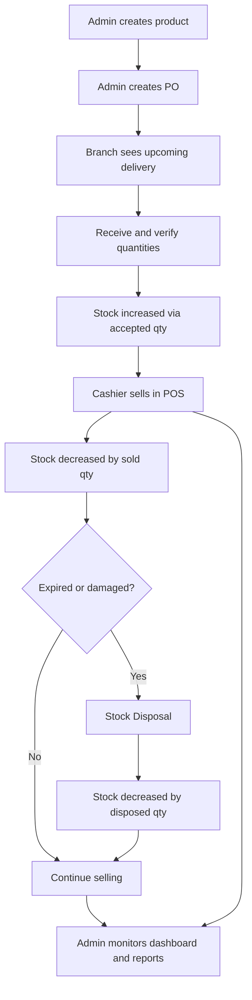

# Business Flows

## Flow 1: Product Setup

**Actor:** Admin (Web)

```
Admin logs in
    ↓
Creates category
    ↓
Creates product
    ↓
Sets selling price
    ↓
Sets reorder level
    ↓
Sets critical level
    ↓
Adds barcode or generates internal barcode
    ↓
Product becomes available in POS and inventory
```

---

## Flow 2: Purchase Order / Expected Delivery

**Actor:** Admin (Web)

```
Admin selects supplier
    ↓
Selects branch
    ↓
Adds products
    ↓
Inputs expected quantity per product
    ↓
Sets expected delivery date
    ↓
System creates upcoming delivery
```

### Example

| Field | Value |
|-------|-------|
| PO Number | PO-000123 |
| Supplier | ABC Supplier |
| Branch | Store 1 |
| Expected Delivery | June 20, 2026 |

**Items:**

| Product | Expected Qty |
|---------|--------------|
| Coke 1.5L | 50 pcs |
| Rice 5kg | 20 pcs |
| Coffee | 30 pcs |

---

## Flow 3: Branch Receives Delivery

**Actor:** Cashier or Store Manager (Android or Web)

```
Open app → Upcoming Deliveries
    ↓
Open delivery checklist
    ↓
Scan or search product
    ↓
Input actual received quantity
    ↓
Input damaged quantity (if any)
    ↓
Input expiry date (optional)
    ↓
Input remarks (optional)
    ↓
Submit receiving
```

### System Records

- Expected quantity
- Received quantity
- Damaged quantity
- Missing quantity (computed)
- Received by
- Received date/time
- Branch
- Supplier
- Delivery reference

---

## Flow 4: Stock Update After Delivery

**Trigger:** Delivery receiving submitted

```
Cloud Function validates user
    ↓
Creates delivery receipt
    ↓
Adds accepted quantity to product stock
    ↓
Creates stock movement record
    ↓
Updates critical stock list
    ↓
Updates dashboard stats
    ↓
Updates purchase order status
```

### Formulas

```
acceptedQty = receivedQty - damagedQty
missingQty  = expectedQty - receivedQty
```

### Example

| Field | Value |
|-------|-------|
| Expected | 50 |
| Received | 48 |
| Damaged | 2 |
| **Accepted (stock added)** | **46** |
| Missing | 2 |

---

## Flow 5: POS Sale

**Actor:** Cashier or Store Manager (Android)

```
Open POS
    ↓
Scan barcode or search product
    ↓
Product added to cart
    ↓
Promo applies if valid
    ↓
Customer pays
    ↓
Sale completed
    ↓
Stock deducted
    ↓
Receipt printed or sent
```

### Stock Deduction

```
newStock = currentStock - soldQty
```

No FEFO/FIFO. No batch selection at checkout.

---

## Flow 6: Expired or Disposed Products

**Actor:** Cashier or Store Manager (Android or Web)

```
Open Stock Disposal
    ↓
Select or scan product
    ↓
Input quantity to deduct
    ↓
Select reason
    ↓
Add remarks / photo (optional)
    ↓
Submit
    ↓
System deducts stock automatically
```

### Disposal Reasons

| Reason | Code |
|--------|------|
| Expired | `EXPIRED` |
| Damaged | `DAMAGED` |
| Spoiled | `SPOILED` |
| Lost | `LOST` |
| Returned to supplier | `RETURNED_TO_SUPPLIER` |
| Disposed | `DISPOSED` |
| Other | `OTHER` |

### Example

| Field | Value |
|-------|-------|
| Product | Yogurt |
| Current Stock | 20 |
| Disposed Qty | 5 |
| Reason | Expired |
| **New Stock** | **15** |

### Stock Movement Created

| Field | Value |
|-------|-------|
| Type | `DISPOSAL` |
| Quantity Change | -5 |
| Reason | Expired |
| User | Cashier Name |
| Date | June 20, 2026 |

---

## Complete Lifecycle


