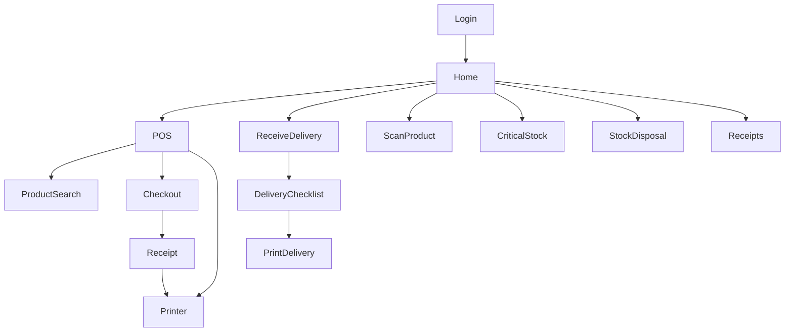

# Android App — Screens and Functions

Kotlin mobile app for in-store operations.

---

## 7.1 Login Screen

| Function | Description |
|----------|-------------|
| Google Sign-In | Firebase Auth |
| Role check | Validate role allows mobile access |
| Branch check | User must have assigned branch |
| Redirect to home | On success |

---

## 7.2 Home Screen

### Primary Actions

| Action | Navigates to |
|--------|--------------|
| POS | POS screen |
| Receive Delivery | Receive delivery screen |
| Scan Product | Scan product screen |
| Critical Stock | Critical stocks screen |
| Stock Disposal | Stock disposal screen |
| Receipts | Receipt history |

### Optional Dashboard Widgets

- Today sales
- Pending deliveries count
- Critical stocks count

---

## 7.3 POS Screen

| Function | Description |
|----------|-------------|
| Scan barcode | Camera scanner |
| Search product manually | Opens product search |
| Add product to cart | |
| Update quantity | +/- controls |
| Remove item | Swipe or button |
| Apply active promo | Auto on eligible items |
| Checkout | Payment flow |
| Print receipt | Bluetooth printer |
| Send receipt | Email / SMS via Cloud Function |

---

## 7.4 Product Search Screen

For products without barcodes or hard-to-scan labels.

| Function | Description |
|----------|-------------|
| Search by name | |
| Search by SKU | |
| Filter by category | |
| Quick product buttons | Configurable favorites |
| Add to cart | Returns to POS |

---

## 7.5 Receive Delivery Screen

| Function | Description |
|----------|-------------|
| View upcoming deliveries | POs for user's branch |
| Open checklist | Per PO |
| Scan / search product | Match line items |
| Input received quantity | |
| Input damaged quantity | Optional |
| Input expiry date | Optional |
| Input remarks | Optional |
| Submit delivery | Calls `receiveDelivery` |
| Print delivery receipt | Bluetooth printer |

---

## 7.6 Scan Product Screen

### Visible to Cashier / Manager

| Field | Shown |
|-------|-------|
| Product name | ✓ |
| Selling price | ✓ |
| Current stock | ✓ |
| Category | ✓ |
| Critical status | ✓ (badge if at/below critical) |

### Hidden from Cashier / Manager

- Supplier cost
- Profit
- Admin notes

---

## 7.7 Stock Disposal Screen

| Function | Description |
|----------|-------------|
| Scan / search product | |
| View current stock | |
| Input disposal quantity | Validated ≤ stock |
| Select reason | Enum picker |
| Add remarks | Optional |
| Submit | Calls `createDisposal` |
| Auto-deduct stock | Server-side |
| Print disposal slip | Optional |

---

## 7.8 Critical Stocks Screen

| Function | Description |
|----------|-------------|
| View critical products | `currentStock <= criticalLevel` |
| View suggested order quantity | `reorderLevel - currentStock` or similar |
| Create purchase request | If permission granted |

---

## 7.9 Receipt Screen

| Function | Description |
|----------|-------------|
| View receipt | After sale |
| Print receipt | |
| Send receipt | Email / SMS |
| Start new sale | Clear cart, return to POS |

---

## 7.10 Bluetooth Printer Screen

| Function | Description |
|----------|-------------|
| Connect printer | Pair Bluetooth device |
| Test print | Sample receipt |
| Print sales receipt | From POS / receipt screen |
| Print delivery receipt | After receiving |
| Print barcode label | Optional utility |

---

## Navigation Map

