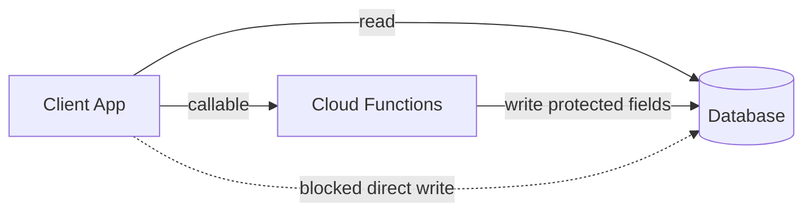

# Business Rules

Enforced in Cloud Functions and security rules.

---

## Stock Rules

| Rule | Detail |
|------|--------|
| Stock increases | Only via **delivery receiving** or **approved stock adjustment** |
| Stock decreases | Only via **sale**, **disposal**, **return**, or **approved stock adjustment** |
| Stock movement | **Every** stock change must create a `stockMovements` document |
| Sale deduction | `newStock = currentStock - soldQty` — no FEFO/FIFO |
| Disposal limit | Disposed quantity must not exceed `currentStock` |
| Negative stock | Not allowed — reject sale/disposal if insufficient |

---

## Price Rules

| Rule | Detail |
|------|--------|
| Owner / Admin | Can always change selling price |
| Cashier | Cannot change price |
| Store Manager | Can change price only if `canChangePrice` permission is enabled |
| Audit trail | Every price change creates an `auditLogs` entry |
| Channel | Price changes go through `changeProductPrice` Cloud Function only |

---

## Supplier Cost Rules

| Role | Visibility |
|------|------------|
| Owner / Admin | Always visible |
| Store Manager | Hidden unless `canViewSupplierCost` is enabled |
| Cashier | Always hidden |

Applies to: product forms, scan screens, reports, API responses.

---

## Delivery Rules

| Rule | Detail |
|------|--------|
| PO link | Delivery must be linked to a purchase order |
| Received qty | Required per line item |
| Damaged qty | Optional (defaults to 0) |
| Expiry date | Optional |
| Missing qty | Computed: `expectedQty - receivedQty` |
| Accepted qty | Computed: `receivedQty - damagedQty` |
| Stock add | Only `acceptedQty` is added to inventory |
| Channel | Receiving goes through `receiveDelivery` Cloud Function only |

---

## Disposal Rules

| Rule | Detail |
|------|--------|
| Quantity | Must not exceed current stock |
| Stock effect | Automatically deducts on submit |
| Movement | Creates `stockMovements` with type `DISPOSAL` |
| Reporting | Appears in disposal / expired reports |
| Channel | Goes through `createDisposal` Cloud Function only |

---

## Promo Rules

| Rule | Detail |
|------|--------|
| Date range | Promo active only between `startDate` and `endDate` |
| Status | Must be `ACTIVE` |
| Scope | Applies to linked product or category |
| Branch | If `branchId` set, only applies at that branch |
| Limits | Respect `minQuantity`, `minSpend`, `usageLimit` if set |

---

## User Access Rules

| Rule | Detail |
|------|--------|
| Inactive users | Blocked at login |
| Branch scope | Store Manager and Cashier see only their branch data |
| Void sale | Requires `canVoidSale` or Admin role |
| Stock adjustment approval | Requires `canApproveStockAdjustment` or Admin role |

---

## Audit Rules

The following actions must write to `auditLogs`:

- Price changes
- Stock adjustments (create and approve)
- Sale void / refund
- User permission changes
- Product archive / restore (recommended)

---

## Security Rules Principle

Clients may **read** most collections (filtered by role in app layer and rules).

Clients may **not** directly write:

- `products.currentStock`
- `products.sellingPrice`
- `sales/*`
- `deliveryReceipts/*`
- `disposals/*`
- `stockMovements/*`
