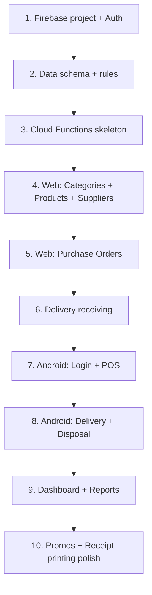

# MVP Features

Build these features first before optional enhancements.

---

## Checklist

### Authentication & Access

- [ ] Google Sign-In (Web + Android)
- [ ] Roles and permissions (Owner/Admin, Store Manager, Cashier)
- [ ] Branch assignment
- [ ] Block inactive users

### Catalog

- [ ] Product management (CRUD, archive)
- [ ] Category management (CRUD, archive)
- [ ] Supplier management (CRUD, archive)
- [ ] Internal barcode generation
- [ ] Product image upload

### Procurement & Receiving

- [ ] Purchase order creation
- [ ] PO status workflow
- [ ] Upcoming delivery list
- [ ] Delivery checklist (Web + Android)
- [ ] Delivery receiving with variance tracking
- [ ] Stock update from delivery (accepted qty)
- [ ] Delivery receipt printing

### Point of Sale

- [ ] POS screen (Android)
- [ ] Barcode scanning
- [ ] Manual product search
- [ ] Cart and checkout
- [ ] Promo discount application
- [ ] Stock deduction on sale
- [ ] Sales receipt printing

### Inventory Operations

- [ ] Current stock view
- [ ] Critical stock dashboard
- [ ] Low stock alerts
- [ ] Stock disposal / expired tagging
- [ ] Stock movement history

### Reporting & Admin

- [ ] Admin dashboard (sales, deliveries, critical stock)
- [ ] Sales list and filters
- [ ] Basic reports (sales, critical stock, delivery, disposal)
- [ ] User management

### Backend

- [ ] Cloud Functions for sensitive operations
- [ ] Security rules
- [ ] `updateCriticalStock` trigger or callable
- [ ] `updateDashboardStats` on key events
- [ ] Audit log for price changes

---

## Out of Scope for MVP

Defer until after MVP is stable:

| Feature | Notes |
|---------|-------|
| Buy X Get Y promos | Optional promo type |
| SMS receipt | Email first |
| Purchase request workflow | Manual PO creation OK for MVP |
| Multi-branch stock subcollection | Single-branch or simple `branchId` first |
| Stock adjustment approval UI | Can stub with Admin-only direct adjustment |
| Advanced profit reports | Basic sales report sufficient |

---

## Suggested Build Order

### Phase 1 — Foundation (Week 1–2)

Firebase setup, auth, user roles, data collections, security rules skeleton.

### Phase 2 — Catalog (Week 2–3)

Web product/category/supplier CRUD, internal barcode.

### Phase 3 — Procurement (Week 3–4)

Purchase orders, upcoming deliveries, delivery receiving, stock increment.

### Phase 4 — POS (Week 4–5)

Android POS, scanning, search, checkout, stock decrement.

### Phase 5 — Operations (Week 5–6)

Disposal, critical stock, dashboard, basic reports, receipt printing.

### Phase 6 — Polish (Week 6+)

Promos, delivery receipt print, export reports, permissions fine-tuning.

---

## Definition of Done (MVP)

The MVP is complete when a user can run this flow end-to-end without manual database edits:

1. Admin signs in on web, creates category and product
2. Admin creates PO for a branch
3. Cashier receives delivery on Android, stock increases
4. Cashier sells product on POS, stock decreases
5. Cashier disposes expired units, stock decreases
6. Admin views dashboard and sales report

See [Business Flows](03-business-flows.md) for the full lifecycle diagram.
