# StockMate POS — How It Works

A complete, diagram-driven walkthrough of the StockMate POS platform: how data flows from
**platform owner → admin → branch manager → cashier**, every request/approval loop, and
the end-to-end lifecycle of sales, procurement, deliveries, stock, and permissions.

> Diagrams are written in **Mermaid** and render automatically in GitHub, VS Code/Cursor
> markdown preview, and most documentation tools.

## Contents

1. [System Architecture](#1-system-architecture)
2. [Roles & Hierarchy](#2-roles--hierarchy)
3. [User Onboarding](#3-user-onboarding)
4. [The Point-of-Sale (Sale) Flow](#4-the-point-of-sale-sale-flow)
5. [Void / Refund Flow](#5-void--refund-flow)
6. [Procurement: Request → PO → Delivery](#6-procurement-request--po--delivery)
7. [Purchase Order State Machine](#7-purchase-order-state-machine)
8. [Purchase Request State Machine](#8-purchase-request-state-machine)
9. [Delivery Receiving Flow](#9-delivery-receiving-flow)
10. [Stock Adjustment Flow](#10-stock-adjustment-flow)
11. [Stock Disposal Flow](#11-stock-disposal-flow)
12. [Permissions: Request vs. Direct Edit](#12-permissions-request-vs-direct-edit)
13. [Real-Time Notifications & Messaging](#13-real-time-notifications--messaging)
14. [Data Flow Summary](#14-data-flow-summary)

---

## 1. System Architecture

Two clients talk to one Firebase backend. **All writes that matter go through Cloud
Functions**, which enforce business rules; clients only read directly (constrained by
security rules) and call functions to make changes.

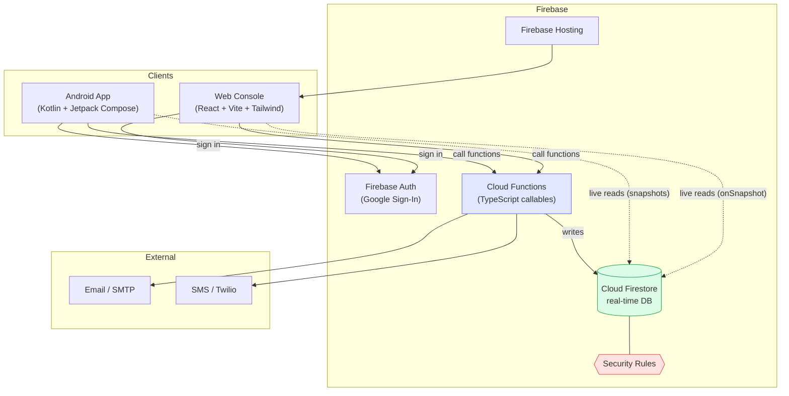

**Key principle:** the UI is a convenience layer. Every callable re-verifies the caller's
identity, role, custom permissions, and branch scope before writing — so a tampered client
cannot bypass the rules.

---

## 2. Roles & Hierarchy

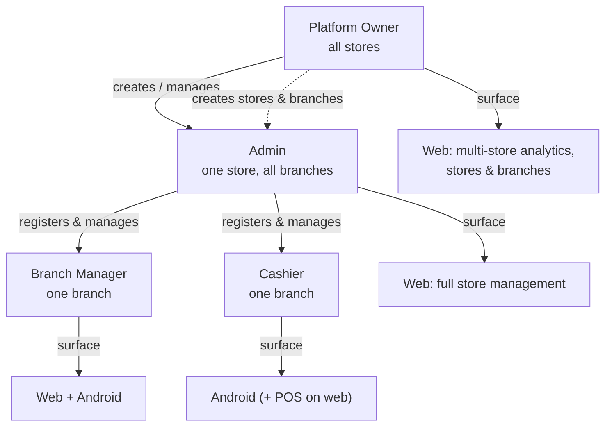

| Capability | Platform Owner | Admin | Manager | Cashier |
|------------|:--:|:--:|:--:|:--:|
| Manage stores / branches | ✅ | branches only | ❌ | ❌ |
| Register users | owners & admins | branch staff | ❌ | ❌ |
| Edit user role/permissions | ✅ | ✅ | ❌ | ❌ |
| Create purchase orders | ✅ | ✅ | ❌ | ❌ |
| Approve requests / adjustments | ✅ | ✅ | ❌ | ❌ |
| Raise purchase request | ✅ (auto-approved) | ✅ (auto-approved) | ✅* | ✅* |
| Sell at POS | ✅ | ✅ | ✅ | ✅ |
| Void a sale | ✅ | ✅ | if granted | if granted |
| Change product price | ✅ | ✅ | if granted | if granted |

\* via the `canCreatePurchaseRequest` permission. Data is always **branch-scoped** for
managers and cashiers.

---

## 3. User Onboarding

Accounts are **invite-based**: an admin/owner registers an email first, then the person
signs in with Google and the system links (claims) their account.

```mermaid
sequenceDiagram
    actor Admin
    participant Web as Web Console
    participant FN as Cloud Functions
    participant FS as Firestore
    actor User as New User
    participant Auth as Firebase Auth

    Admin->>Web: Register user (name, email, role, branch)
    Web->>FN: registerUserEmail(...)
    FN->>FN: Verify caller is admin/owner + role rules
    FN->>FS: Create registeredEmails doc (claimed = false)
    Note over FS: Appears under "Awaiting first sign-in"

    User->>Auth: Sign in with Google (same email)
    User->>FN: claimAccount()
    FN->>FS: Match registeredEmails by email
    FN->>FS: Create users + userStoreIndex; mark claimed = true
    FN-->>User: Profile ready (role, branch, permissions)
```

If the email isn't pre-registered, sign-in is denied access to any store.

---

## 4. The Point-of-Sale (Sale) Flow

A cashier builds a cart (by **search or barcode scan**), then checks out. The server
recomputes everything — never trusting client-sent prices — applies promos, adjusts stock
atomically, and refreshes dashboards.

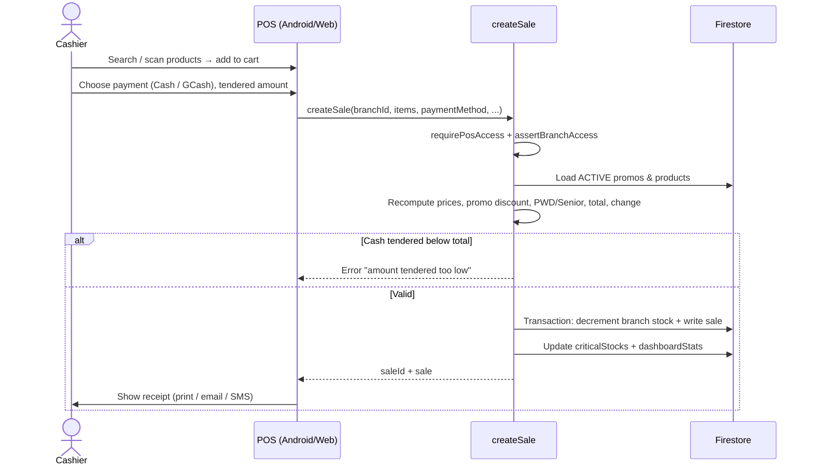

**Why server-side:** prices, promo logic, stock decrement, and change calculation all run
in a Firestore transaction so two simultaneous sales can't oversell the same stock.

---

## 5. Void / Refund Flow

Voiding is gated by `canVoidSale`. Staff without the permission must get an approval.

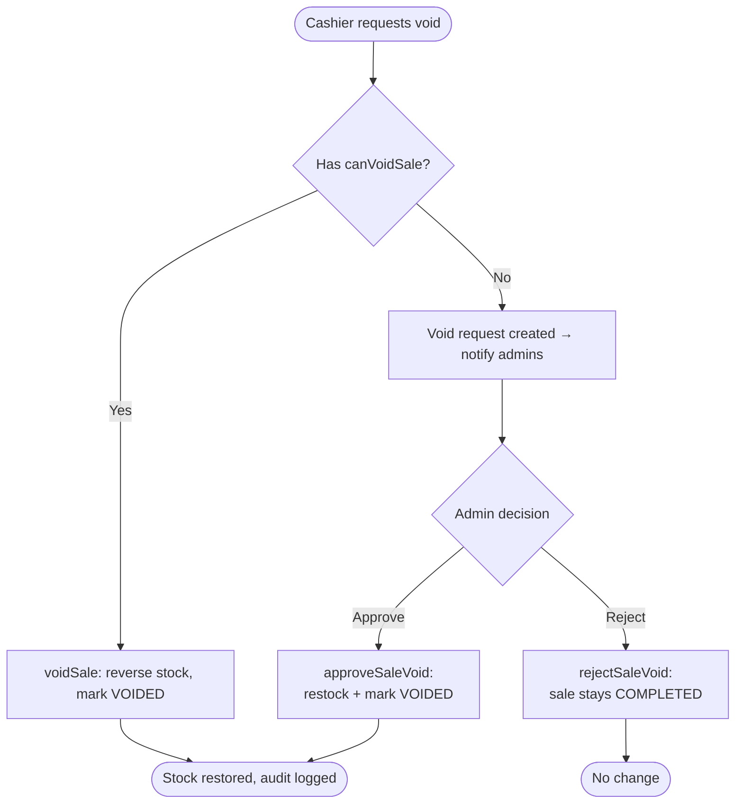

---

## 6. Procurement: Request → PO → Delivery

Branch staff **request**, admins **order**, the branch **receives**. Admins can also start
their own requests, which are auto-approved.

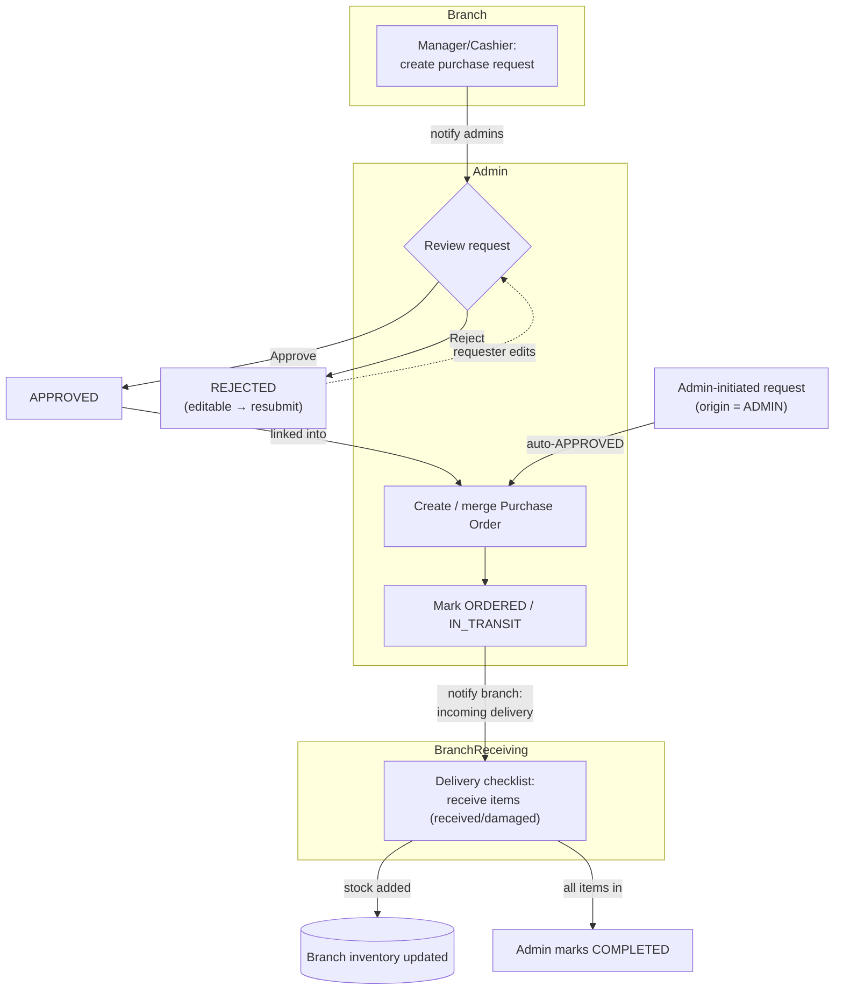

Requests can be for a **product reorder** or to ask for a **new product / category /
supplier**; the latter is closed via `fulfillPurchaseRequest` once the admin creates it.

---

## 7. Purchase Order State Machine

Transitions are enforced server-side (`VALID_TRANSITIONS`); illegal jumps are rejected.

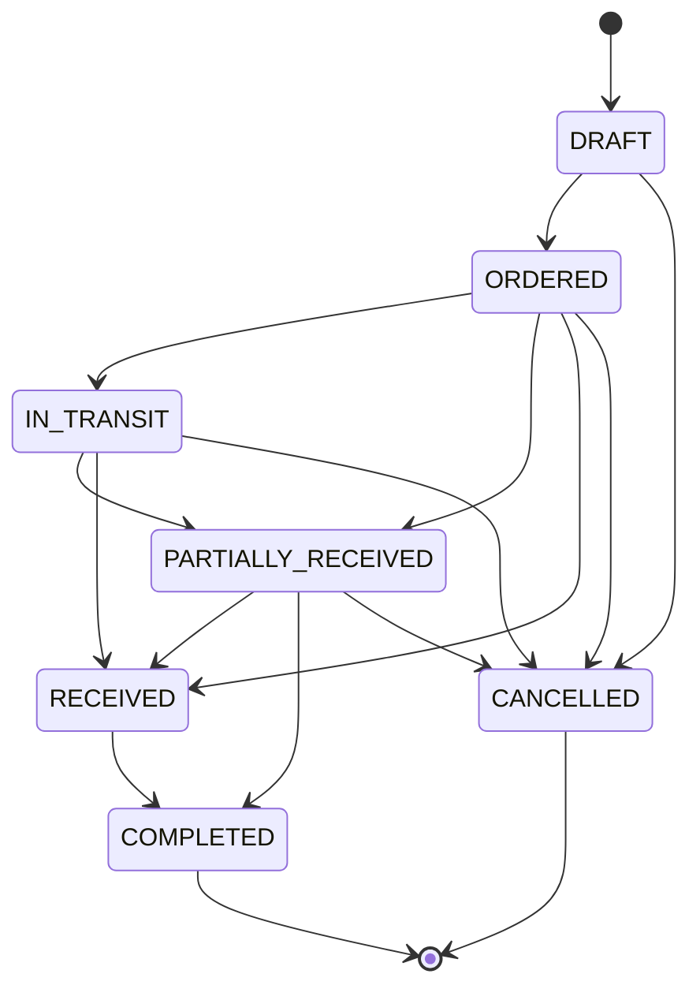

---

## 8. Purchase Request State Machine

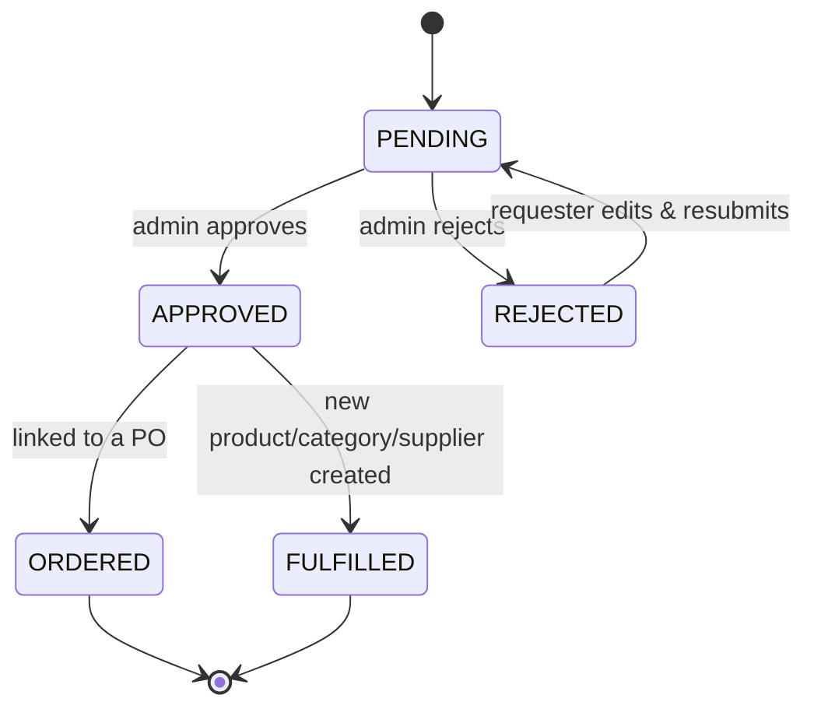

---

## 9. Delivery Receiving Flow

On Android, staff can **scan-to-locate** an item — the checklist scrolls to and highlights
the matching line.

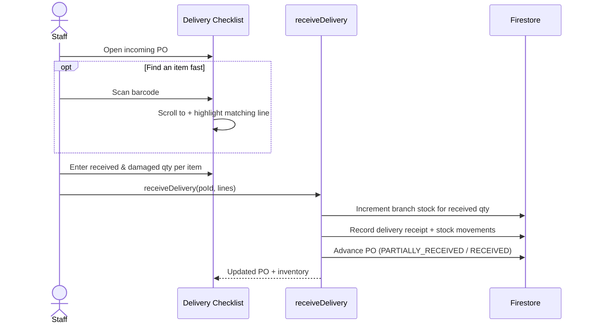

---

## 10. Stock Adjustment Flow

Adjustments correct stock discrepancies and require approval
(`canApproveStockAdjustment`).

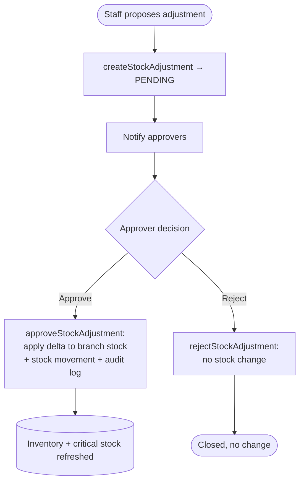

---

## 11. Stock Disposal Flow

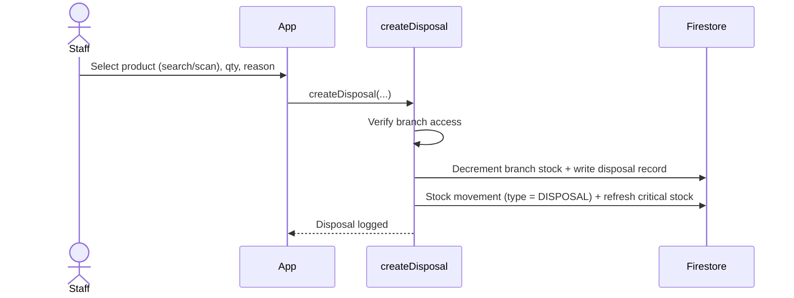

---

## 12. Permissions: Request vs. Direct Edit

Two paths, one source of truth. Both write the same permission flags and log an audit
entry.

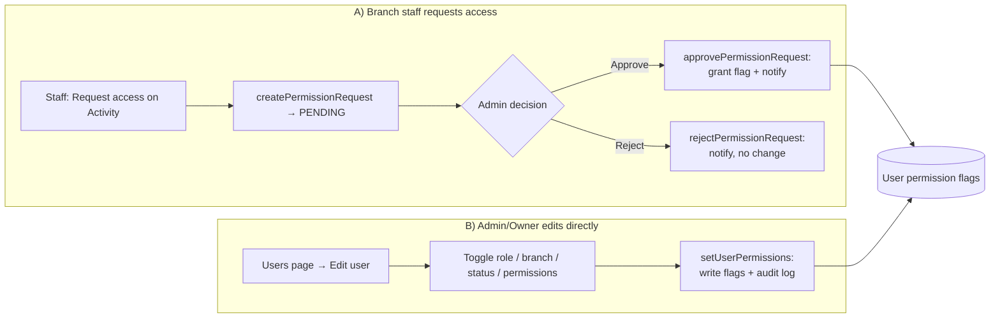

**Edit user modal** consolidates role, branch, active status, and the five permission
toggles into a single popup; saving only sends what actually changed.

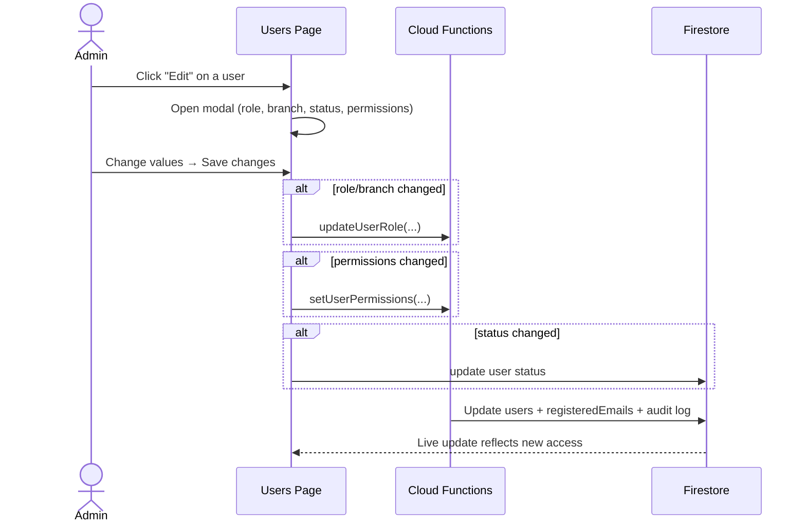

The five grantable flags: **Void Sale**, **Approve Stock Adjustment**, **View Supplier
Cost**, **Create Purchase Request**, **Change Price**.

---

## 13. Real-Time Notifications & Messaging

Every significant action emits an in-app notification and (where relevant) a threaded
message, all delivered live via Firestore listeners.

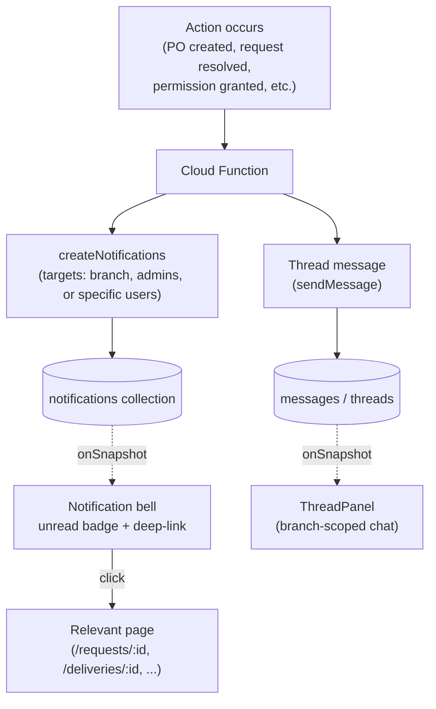

Notification kinds include PO created/completed, purchase request & resolution, stock
adjustment, sale void, messages, and permission request / resolved.

---

## 14. Data Flow Summary

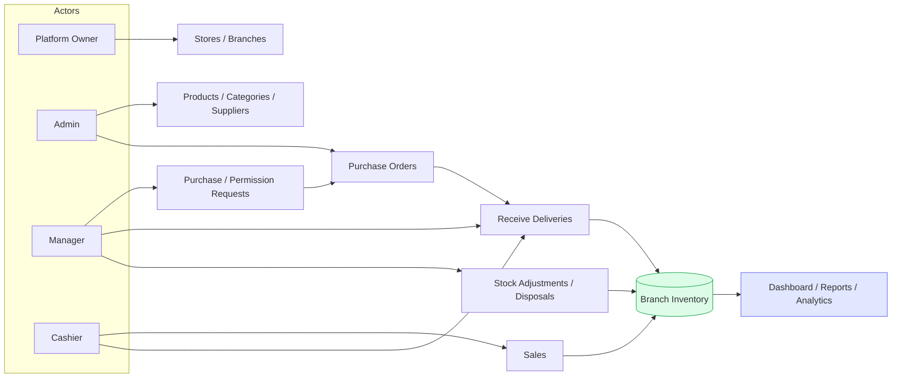

Everything ultimately converges on **branch inventory**, which powers the **dashboard,
reports, and analytics** in real time.

---

*See [`../FEATURES.md`](../FEATURES.md) for the feature catalog and [`../README.md`](../README.md)
for setup. For the full product specification, see [`README.md`](README.md) in this folder.*
